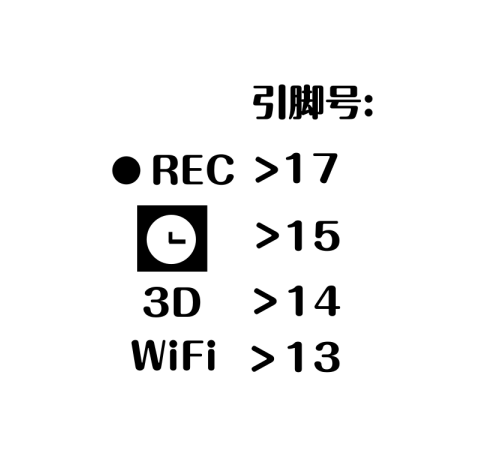
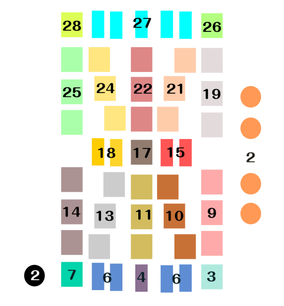
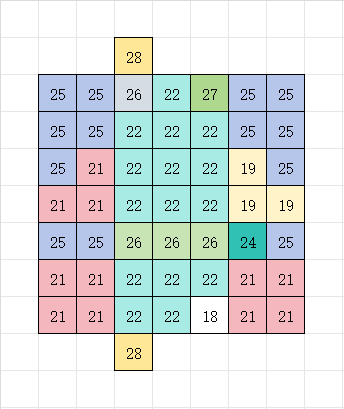
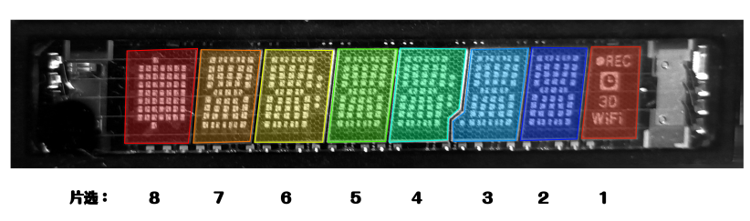
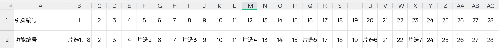

# 7‑BT‑317NK VFD 引脚定义 Pin‑out

> 图片文件保存在仓库根目录
**引脚编号从左到右 Pin number order: left‑to‑right**

## 引脚分布图 Pin‑out Diagram

## 片选分区 Chip‑select Layout

## 引脚分布图 Pin‑out Diagram
 

 ### 电气参数 Electrical Specifications
 - 灯丝供电 Filament：AC 2.4 V（交流2.4伏）
 - 栅极与阳极（显示极板）Grid & Anode：12 V

---
## 项目状态 Project Status
**中文**：目前仅整理7‑BT‑317NK VFD荧光显示屏引脚定义。硬件电路、PCB、固件均尚未开发，本项目后续有可能搁置，不保证完成。

**English**: Only the pin‑out definition of the 7‑BT‑317NK VFD screen is sorted out for now. Hardware circuit, PCB and firmware are not developed. This project may be suspended and completion is NOT guaranteed.
